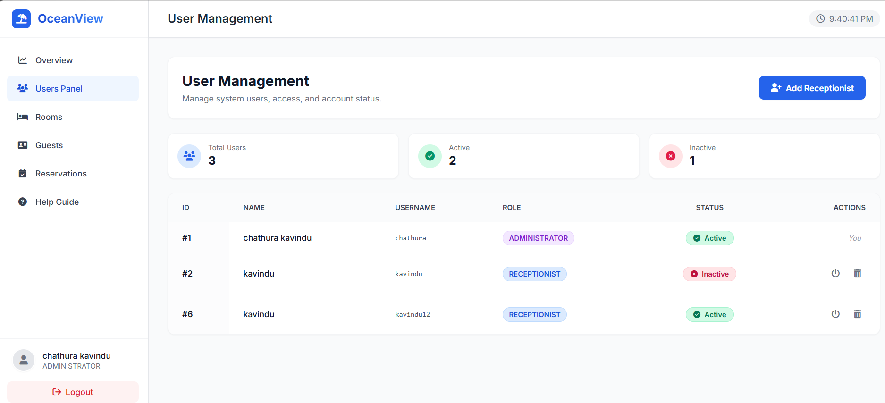
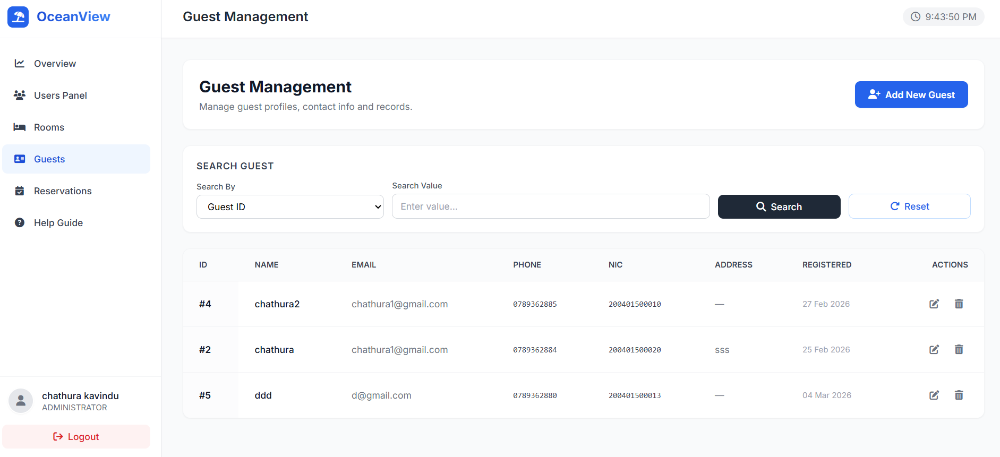
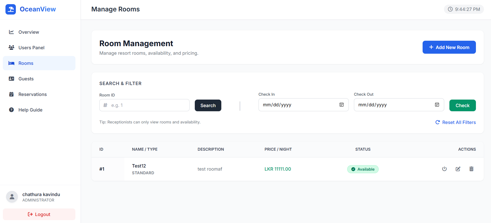
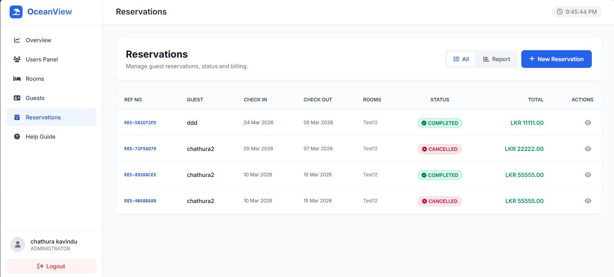
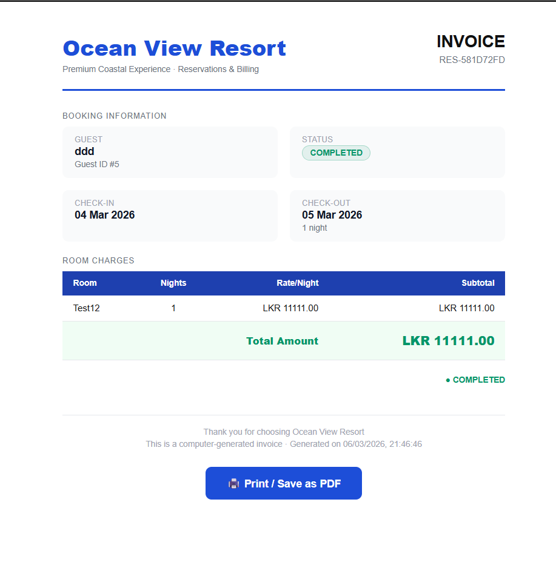
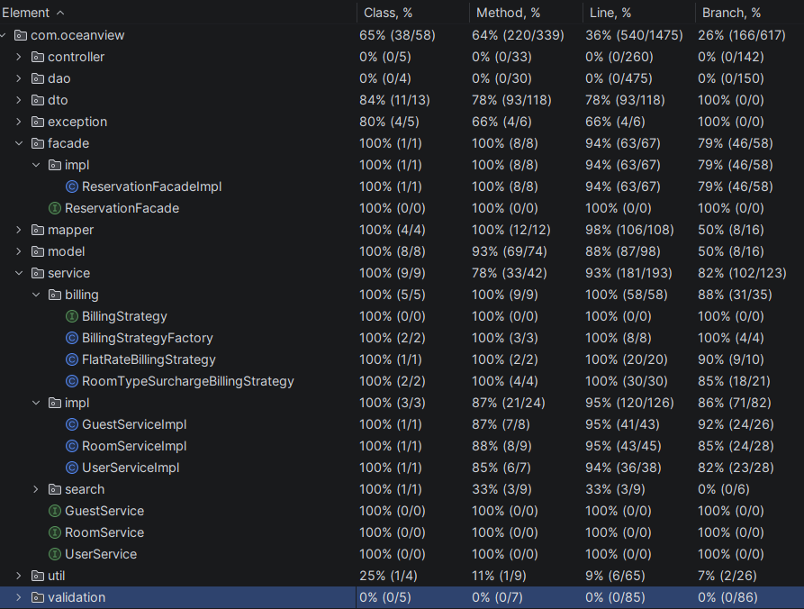

# Ocean View Resort – Distributed Online Reservation System

**Module:** CIS6003 – Advanced Programming  
**Course:** BSc (Hons) Software Engineering  
**Author:** Chathura Kavindu Bandara

---
## 🎥 Ocean View Resort System Demo

This video demonstrates the main features of the Ocean View Resort distributed reservation system including guest management, room management, and reservation processing.

## 📖 Project Overview

Ocean View Resort is an enterprise-grade, distributed online room reservation system designed to streamline hotel operations. It completely replaces legacy manual booking processes with a modern, secure, and highly scalable architecture. The system is built using the **Java Servlet API**, **JDBC**, and a robust relational database back-end.

This project was engineered to meticulously align with Java EE fundamentals and industry best practices, strictly adhering to:

- **3-Tier Architecture** for robust separation of concerns.
- **OOP,OOD** and **SOLID Principles** for maintainability.
- **Design Pattern Implementation** (Strategy, Facade, Singleton, DAO) for scalable logic.
- **Test-Driven Development (TDD)** aligned Service-Level Unit Testing.

---

## 🏗️ System Architecture

The project implements a strict, decoupled **3-Tier Architecture**:
### 1. Presentation Layer (Web/API)

The topmost layer handles all incoming HTTP requests and responses. It serves as a JSON-based RESTful API interface for the frontend application.

- **Technology:** Java Servlets, HTML, CSS, JavaScript (Vanilla).
- **Features:**
  - Centralized request routing and generic exception handling (`BaseServlet`).
  - Standardized HTTP status codes (200, 201, 400, 404, 500).
  - Secure session management.

### 2. Business Logic Layer (Services)

The core computation layer where all business rules, validations, and logic reside. This layer is entirely agnostic of the web and database layers, making it highly testable.

- **Features:**
  - Service implementations mapped to specific domains (e.g., `ReservationService`, `RoomService`).
  - **Constructor-based Dependency Injection** for loose coupling and easy mocking.
  - Implementations of the **Strategy Pattern** for dynamic behaviors (Billing, Validation).
  - Clean exception-driven flow control (`BusinessRuleException`).

### 3. Data Access Layer (DAO)

The persistence layer responsible for all interactions with the MySQL database.

- **Technology:** JDBC (MySQL).
- **Features:**
  - Strict adherence to the **Data Access Object (DAO) Pattern**.
  - Custom abstraction for SQL exceptions (`DataAccessException`).
  - Singleton pattern for managing efficient database connections.

---

## 🚀 Core Modules & Features

The system is divided into highly cohesive, loosely coupled functional modules. Below is a detailed technical breakdown of each.

### 👥 User Management Module

This module governs authentication, authorization, and administrator controls.

- **Secure Authentication:** User passwords are encrypted using SHA-256 hashing algorithms before persistence, ensuring defense against data leaks.
- **Role-Based Access Control:** Strict validation prevents accidental deletion of system administrators, enforcing role-based security.
- **Account State Management:** Users can be activated or deactivated without soft/hard deletion, preserving referential integrity.
- **Validation:** Service-layer rules actively prevent the creation of duplicate usernames, utilizing exception-driven validation to relay meaningful errors back to the client.

### 🛎️ Guest Management Module

Manages the lifecycle of customer (guest) data, crucial for reservations and billing.

- **Comprehensive CRUD:** Full ability to Create, Read, Update, and Delete guest profiles.
- **Advanced Search:** Allows staff to quickly locate guests using unique identifiers such as ID, National Identity Card (NIC), or contact number.
- **Data Integrity:** Real-time duplication checks at the service layer guarantee that guest records remain unique and consistent.

### 🛏️ Room Management Module

Handles the physical inventory of the resort, bridging room availability with operational status.

- **Inventory Control:** Complete CRUD functionality for hotel rooms.
- **Idempotent Availability Updates:** Ensures repetitive updates to room availability do not cause side-effects or corrupt state.
- **Smart Date-Range Queries:** Empowers receptionists to query for available rooms based strictly on specified check-in/check-out dates.
- **Maintenance Lifecycle:** Rooms can be securely transitioned into a maintenance state, reliably removing them from the available booking pool.

### 📅 Reservation Management Module

The most complex module, handling booking lifecycles and conflict prevention.

- **Lifecycle Management:** A reservation traverses specific states: Created -> Confirmed -> Completed or Cancelled.
- **Intelligent Conflict Detection:** Implements algorithm-based overlapping booking prevention. The system detects if check-in/out dates cross over with any pre-existing confirmed reservations for a specific room.
- **Boundary Condition Handling:** Safely handles edge cases cleanly (e.g., check-in and check-out on the same day).
- **Availability Enforcement:** Confirmed and ongoing reservations actively block room availability, whereas cancelled ones immediately unlock the room back into the inventory pool.

### 💰 Billing Module (Strategy Pattern)

A highly scalable price calculation engine.

To adhere to Open Closed principles, billing logic utilizes the **Strategy Design Pattern**, allowing runtime injection of different pricing models without modifying core code.

- **`FlatRateBillingStrategy`:** Standard night-by-night cost calculations without modifiers.
- **`RoomTypeSurchargeBillingStrategy`:** Dynamic price calculation taking into account luxury/suite room type multipliers and seasonal modifiers.
- **Features:** Night-based calculus, total line-item aggregations, and strict business rule validation rejecting mathematically impossible rates (e.g., negative nights).

---

## ⚙️ Software Design Patterns Applied

A defining characteristic of this project is the integration of standard Gang of Four (GoF) design patterns to solve common architectural problems:

1. **Strategy Pattern (Billing / Validation):** Allowed the decoupling of billing algorithms and complex validation sequences from the monolithic service logic.
2. **Data Access Object (DAO) Pattern:** Abstracted all SQL and database interactions, providing simple in-memory-like lists/objects to the service layer.
3. **Facade Pattern:** Provided a unified interface to the complex subsystems (especially evident in the interactions between reservations, rooms, and billing computations).
4. **Singleton Pattern:** Employed exclusively for managing the Database Connection lifecycle, preventing thread-exhaustion and memory leaks.
5. **Constructor-Based Dependency Injection (DI):** Enabled high modularity and facilitated rigorous automated testing by easily swapping out real DAOs for mocked/fake DAOs.

---

## 🧪 Testing Strategy & Quality Assurance

Quality assurance is heavily focused on the **Service Layer** via a Test-Driven Development (TDD) mindset, ensuring that the critical business rules function flawlessly regardless of the UI or Database stability.

- **Framework:** JUnit 4.13.2
- **Testing Methodology:**
  - **FakeDAO Implementations:** In memory lists simulate database interactions, allowing lightning-fast, highly isolated service tests.
  - **Exception Expectation:** Purposely feeding invalid data (duplicate names, conflicting dates) to ensure `BusinessRuleException` is thrown correctly.
  - **Date Boundary Testing:** Stress-testing the most complex logic: reservation conflict algorithms.

---

## 🌿 Git Version Control & Workflow

The repository was strictly managed using branching and tagging best practices.

- **Dev:** The active development and feature integration branch.
- **Test:** The staging area for executing unit tests and verifying stable builds.
- **Master:** Protected branch reserved strictly for production ready releases.

**Version Tags Included:** `v0.2.0-user-module`, `v0.3.0-room-module`, up to the final `v1.1.1`.

---

## 🛠️ Technology Stack

- **Backend:** Java 21+, Java Servlet API, JDBC
- **Database:** MySQL 8+
- **Frontend:** HTML5, CSS3, Vanilla JavaScript (Fetch API for REST)
- **Build & Management:** Apache Maven, Apache Tomcat 9
- **Testing:** JUnit 4.13.2, Postman

---

## 🚀 Getting Started / Setup Guide

### 1. Database Configuration

1. Install MySQL and create a database named `ocean_view_resort`.
2. Locate the SQL schema file within the project repository (`src/main/resources/schema.sql` or similar) and execute it to generate the tables.
3. Update the `db.properties` or database configuration class with your local MySQL credentials.

### 2. Running the Application via Maven & Tomcat

1. Ensure Java 21, Maven, and Tomcat 9 are installed and path variables are configured.
2. Clone this repository locally.
3. Execute `mvn clean install` to build the `.war` package.
4. Deploy the `.war` file to your Tomcat Server's `webapps` directory, or configure Smart Tomcat within IntelliJ IDEA/Eclipse to run it directly.
5. Access the application on standard localhost ports (typically `http://localhost:8080/oceanview`).

---

_This project was developed to demonstrate enterprise architectural patterns, secure back-end processing, and scalable Java programming concepts._
